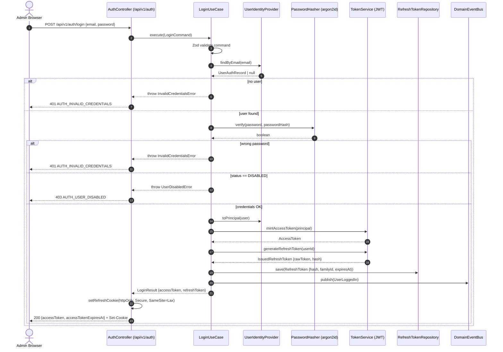
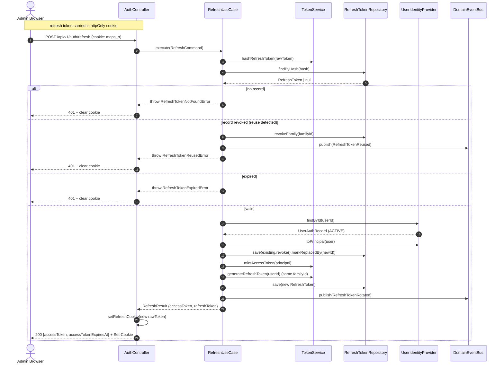
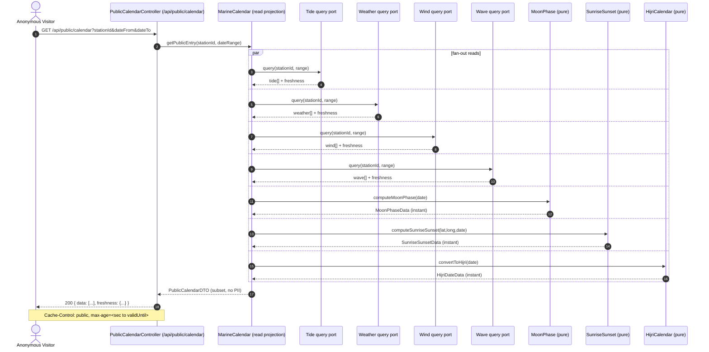
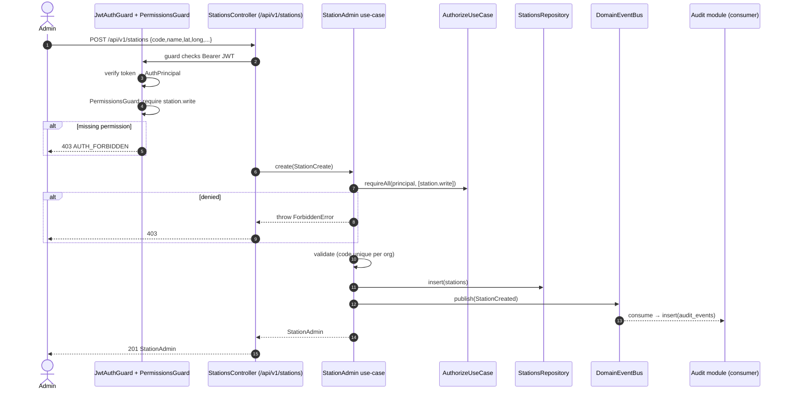
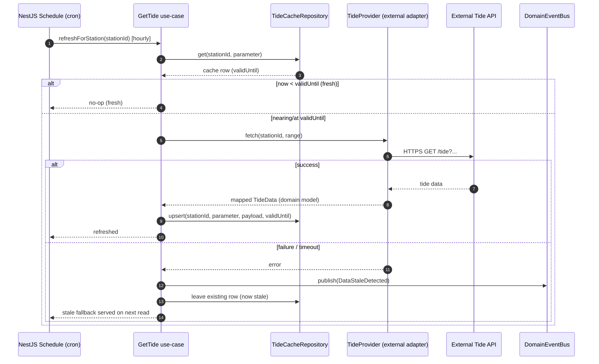
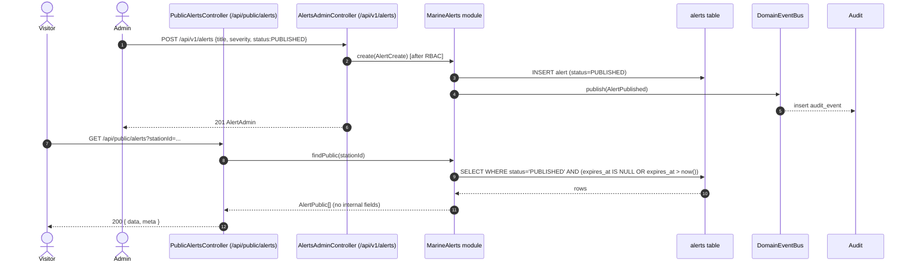
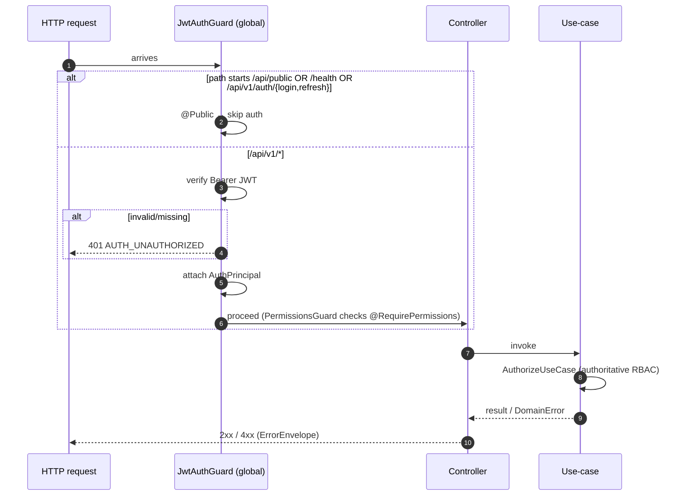

# Sequence Diagrams — MarineOps Hub

**Version:** 2.0.0  
**Last updated:** 2026-07-31  
**Status:** Baseline (Frozen)  
**Authorised by:** ADR-0011  
**Related:** [SYSTEM_ARCHITECTURE](../architecture/SYSTEM_ARCHITECTURE.md), [AUTHENTICATION](../architecture/AUTHENTICATION.md), [ROUTES](../architecture/ROUTES.md), [OPENAPI](OPENAPI.md)

Diagrams are written in **Mermaid** so they render in any Markdown viewer that supports Mermaid (GitHub, GitLab, IDE preview). Each diagram maps to SRS requirement IDs.

---

## 1. Admin Login (FR-AUTH-001, FR-AUTH-002, FR-AUTH-006)

---

## 2. Refresh Token Rotation + Reuse Detection (FR-AUTH-003, FR-AUTH-004)

---

## 3. Public Calendar Read (FR-CAL-001, FR-CAL-002, FR-TID/WEA/WND/WAV/MON/SUN/HIJ-001)

No authentication. Read-through projection across multiple modules.

> Sourced modules (Tide/Weather/Wind/Wave) internally check their cache first; on stale they attempt an external fetch and fall back to cached-with-`stale` flag per ADR-0008 (see diagram 5).

---

## 4. Admin Station CRUD with Audit (FR-STN-001..004, FR-AUD-001..002)

---

## 5. Sourced Data Refresh (cron) + Stale Fallback (FR-TID-002, FR-TID-003, NFR-REL-002)

---

## 6. Public Alert Read vs Admin Alert Publish (FR-ALR-001..004)

Shows the public/admin read-sharing pattern on the same `alerts` table.

---

## 7. Request lifecycle: public vs admin gating (NFR-SEC-001)

---

## 8. Change log

| Version | Date       | Notes                                    |
| ------- | ---------- | ---------------------------------------- |
| 2.0.0   | 2026-07-31 | Initial Hub sequence diagrams (ADR-0011) |
