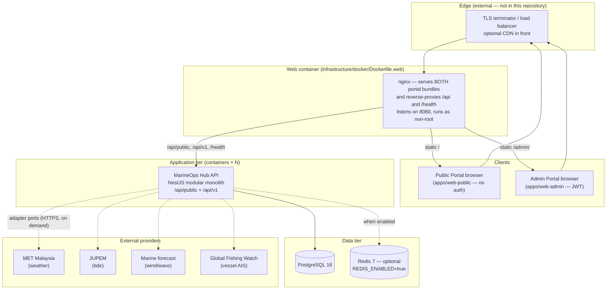
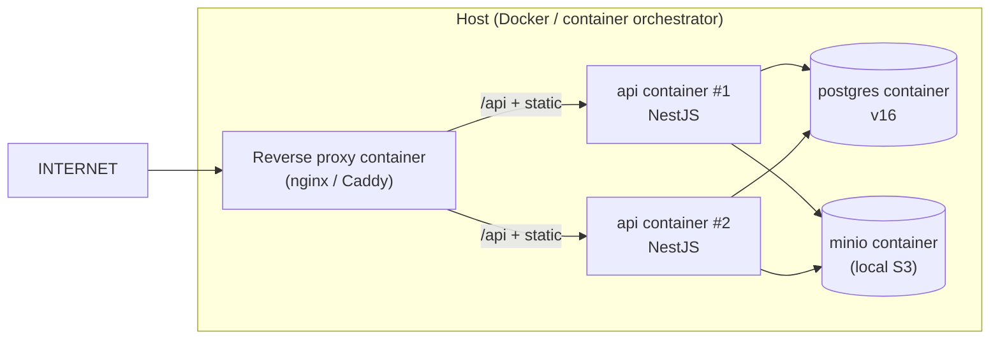

# Deployment Diagram — MarineOps Hub

**Version:** 2.0.0  
**Last updated:** 2026-07-31  
**Status:** Baseline (Frozen)  
**Authorised by:** ADR-0011  
**Related:** [SYSTEM_ARCHITECTURE](SYSTEM_ARCHITECTURE.md), [API_VERSIONING](API_VERSIONING.md), [AUTHENTICATION](AUTHENTICATION.md)

---

## 1. Topology

**Provider data is fetched on demand and cached** — there is no background
refresh. `@nestjs/schedule` is a dependency and `src/shared/scheduler`
contains an unwired scheduler module, but nothing registers a cron job and
no `@Cron` handler exists anywhere in the application. A read that misses
the cache calls the provider inline; the cache is the only thing keeping
provider traffic down. Earlier revisions of this diagram showed an
in-process cron doing hourly refresh, which was never built.

There is likewise no object storage: nothing in the API reads or writes
S3, and no artefacts are stored outside PostgreSQL.

---

## 2. Routing at the edge

nginx in the web container routes by path prefix (the config is
`infrastructure/docker/nginx.conf`; a CDN in front is optional and adds
nothing that is required):

| Path            | Target                                              | Notes                                           |
| --------------- | --------------------------------------------------- | ----------------------------------------------- |
| `/`             | Public Portal static build (`apps/web-public` dist) | Cache aggressively                              |
| `/admin`        | Admin Portal static build (`apps/web-admin` dist)   | No shared cache (per-user)                      |
| `/api/public/*` | API containers × N                                  | Edge rate-limit per IP; `Cache-Control: public` |
| `/api/v1/*`     | API containers × N                                  | No edge cache; `Allow-Credentials: true`        |
| `/health/*`     | API containers × N                                  | Unauthenticated                                 |

- TLS terminates at the edge in all non-local environments (NFR-SEC-004).
- Public read responses are cached at the CDN up to the data's `validUntil` (see API_VERSIONING §7).

---

## 3. Environments

| Environment  | Purpose               | API URL                                 | DB                           | Notes                                                        |
| ------------ | --------------------- | --------------------------------------- | ---------------------------- | ------------------------------------------------------------ |
| `local`      | Developer machine     | `http://localhost:3000`                 | Docker Compose PostgreSQL    | `NODE_ENV=development`; cookie `Secure=false` for local HTTP |
| `staging`    | Pre-prod verification | `https://staging-api.marineops.example` | Managed Postgres (staging)   | Mirrors prod shape; synthetic data                           |
| `production` | Live                  | `https://api.marineops.example`         | Managed Postgres (prod) + S3 | `NODE_ENV=production`; TLS; cookie `Secure=true`             |

Configuration is 12-factor: all environment-specific values via env vars (`.env.example` committed; `.env` never committed).

---

## 4. Container composition

- In `local`: `docker compose -f infrastructure/docker/docker-compose.yml up` starts Postgres (+ MinIO) and the API runs via `pnpm dev:api`.
- In `staging`/`prod`: API containers scale horizontally behind the reverse proxy; Postgres and S3 are managed services. Cron runs inside **each** API container but jobs are idempotent (re-fetch on startup) so duplicate runs across replicas are safe for Phase 1 (ADR-0009 §"Additional: scheduled tasks").

---

## 5. Data flow summary

| Flow                          | Path                                                                                |
| ----------------------------- | ----------------------------------------------------------------------------------- |
| Public read                   | Browser → CDN → `/api/public` → API → Postgres (cache/table) → response (cacheable) |
| Admin read                    | Browser → CDN → `/api/v1` (JWT) → API → Postgres → response                         |
| Admin write                   | Browser → `/api/v1` (JWT + RBAC) → use-case → Postgres + Audit event                |
| External fetch (on read miss) | API → adapter port → external API → cache write → response                          |
| Scheduled refresh             | Cron (in API) → use-case → cache check → external API → cache upsert                |
| Stale fallback                | External API fails → serve cached row with `stale` flag → emit `DataStaleDetected`  |

---

## 6. Secrets & configuration

- Secrets (`JWT_ACCESS_SECRET`, `JWT_REFRESH_SECRET`, DB credentials, external API keys) live in the environment/secret store — never in the image or repo.
- External API keys are loaded only in `infrastructure/` layers; domain and application never see them (ADR-0008 §3).
- The Public Portal build contains **no secrets** and **no auth code**.

---

## 7. Observability in deployment

- Structured JSON logs from API containers → log aggregator.
- `/health/live` and `/health/ready` used by the reverse proxy for routing/health checks.
- Metrics tagged `portal=public` vs `portal=admin` so alerting can distinguish surfaces (NFR-OBS-004).
- External API latency/error/quota metrics per provider (NFR-OBS-003).

---

## 8. Scaling notes (Phase 1)

- API is stateless (JWT self-validating) → horizontal scale behind the proxy.
- Postgres is the single shared store; scale vertically first. Cross-module joins are avoided by design (§9) to keep queries indexable.
- CDN absorbs the bulk of public read traffic, so API load is dominated by admin + cache misses.
- Future: if cron or heavy exports outgrow the API process, introduce BullMQ + Redis via a new ADR (ADR-0009 §"Additional").

---

## 9. Change log

| Version | Date       | Notes                                     |
| ------- | ---------- | ----------------------------------------- |
| 2.0.0   | 2026-07-31 | Initial Hub deployment diagram (ADR-0011) |
