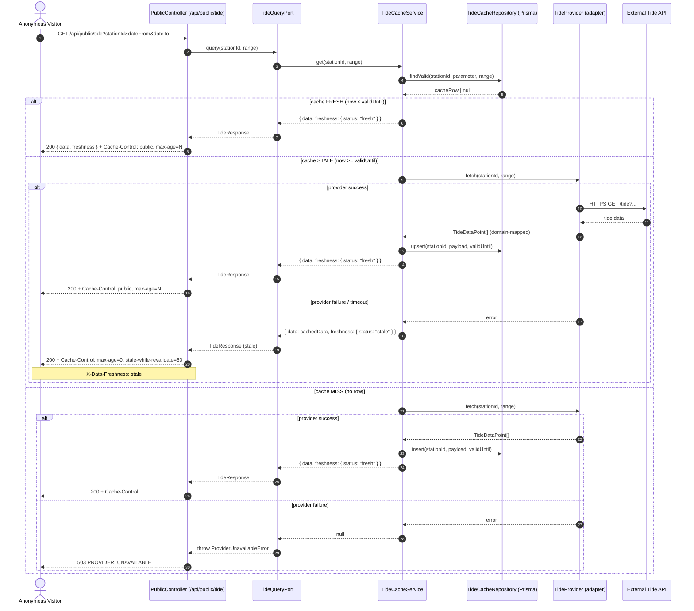

# §10 — Public API Architecture: MarineOps Hub

**Version:** 2.0.0  
**Last updated:** 2026-08-05  
**Status:** Baseline (Frozen)  
**Authorised by:** ADR-0011, ADR-0008  
**Related:** [API_VERSIONING](API_VERSIONING.md), [ROUTES](ROUTES.md), [DATABASE_OWNERSHIP](DATABASE_OWNERSHIP.md), [OPENAPI](../api/OPENAPI.md), [ERD](../data/ERD.md), [SRS](../requirements/SRS.md)

---

## 1. Public API structure

The Public API surface lives under the `/api/public` prefix. It is:

- **Anonymous** — no authentication, no cookies, no Authorization headers.
- **Read-only** — GET only; no POST/PATCH/DELETE on this surface.
- **PII-free** — responses contain no personal data, no admin metadata.
- **Cacheable** — responses are safely cacheable at shared CDNs (NFR-SEC-007).
- **Rate-limited** — per IP at the edge (NFR-RATE-001).

### 1.1 Route map

```
/api/public
├── /calendar          — Unified marine calendar projection (flagship)
├── /tide              — Tide height/timing (sourced, cached)
├── /weather           — Marine weather forecast (sourced, cached)
├── /wind-wave         — Combined wind + wave data (sourced, cached)
├── /moon              — Moon phase (computed, instant)
├── /sun               — Sunrise/sunset (computed, instant)
├── /dashboard         — Public dashboard summary (read projection)
├── /alerts            — Published marine alerts (filtered)
├── /stations          — Active stations (public projection)
├── /stations/{id}     — Single station (public projection)
├── /hijri             — Hijri date conversion (computed, instant)
└── /about             — Static about content
```

> **Note:** `/wind-wave` is a combined endpoint per Sprint 3.0 design. The OpenAPI also defines separate `/wind` and `/wave` endpoints for granular access. Both patterns are supported; the combined endpoint reduces round-trips for the Public Portal's "Angin & Ombak" page.

### 1.2 Controller location

All public controllers live under `apps/api/src/api/public/` per FOLDER_STRUCTURE.md §2.2:

```
src/api/public/
├── public-calendar.controller.ts
├── public-tide.controller.ts
├── public-weather.controller.ts
├── public-wind-wave.controller.ts
├── public-moon.controller.ts
├── public-sun.controller.ts
├── public-dashboard.controller.ts
├── public-alerts.controller.ts
├── public-stations.controller.ts
├── public-hijri.controller.ts
└── public-about.controller.ts
```

Every public controller is decorated `@Public()` and mounted under `/api/public`. A CI lint rule forbids:
- `@Public()` on any controller outside `src/api/public/`.
- Importing a command/write use-case from any file under `src/api/public/`.

### 1.3 CORS

| Header | Value |
|--------|-------|
| `Access-Control-Allow-Origin` | `*` (or allow-list of partner domains) |
| `Access-Control-Allow-Credentials` | `false` |
| `Access-Control-Allow-Methods` | `GET` |

No cookies, no Authorization headers are sent or received on this surface.

---

## 2. Endpoints

### 2.1 `/api/public/calendar`

**SRS:** FR-CAL-001..003  
**Method:** GET  
**Auth:** None  
**Parameters:**

| Param | Type | Required | Description |
|-------|------|----------|-------------|
| `stationId` | string | Yes | Station reference |
| `dateFrom` | date | Yes | Range start |
| `dateTo` | date | Yes | Range end |
| `view` | enum: `day`, `week`, `month` | No | Calendar view mode |

**Response:** `CalendarResponse` — per-day combined projection with tide, weather, wind, wave, moon, sun, and hijri data.

**Caching:** `Cache-Control: public, max-age=<seconds-to-earliest-validUntil>`

### 2.2 `/api/public/tide`

**SRS:** FR-TID-001..003  
**Method:** GET  
**Auth:** None  
**Parameters:** `stationId`, `dateFrom`, `dateTo`  
**Response:** `TideResponse` — `data[]` + `freshness` envelope  
**Caching:** `Cache-Control: public, max-age=<seconds-to-validUntil>`

### 2.3 `/api/public/weather`

**SRS:** FR-WEA-001..004  
**Method:** GET  
**Auth:** None  
**Parameters:** `stationId`, `dateFrom`, `dateTo`  
**Response:** `WeatherResponse` — `data[]` + `freshness` envelope  
**Caching:** `Cache-Control: public, max-age=<seconds-to-validUntil>`

### 2.4 `/api/public/wind-wave`

**SRS:** FR-WND-001..003, FR-WAV-001..003  
**Method:** GET  
**Auth:** None  
**Parameters:** `stationId`, `dateFrom`, `dateTo`  
**Response:** `WindWaveResponse` — combined wind + wave `data[]` + `freshness` envelope  
**Caching:** `Cache-Control: public, max-age=<min(wind-validUntil, wave-validUntil)>`

> The granular endpoints `/api/public/wind` and `/api/public/wave` remain available for module-specific queries. The combined `/wind-wave` endpoint is an optimisation for the Public Portal.

### 2.5 `/api/public/moon`

**SRS:** FR-MON-001..003  
**Method:** GET  
**Auth:** None  
**Parameters:** `date` (required)  
**Response:** `MoonResponse` — phase name, illumination, moonrise, moonset  
**Caching:** `Cache-Control: public, max-age=86400` (24h — computable, deterministic per date)

### 2.6 `/api/public/sun`

**SRS:** FR-SUN-001..003  
**Method:** GET  
**Auth:** None  
**Parameters:** `stationId` (required), `date` (required)  
**Response:** `SunResponse` — sunrise, sunset  
**Caching:** `Cache-Control: public, max-age=86400` (24h — computable, deterministic per date+location)

### 2.7 `/api/public/dashboard`

**SRS:** FR-DSH-001..002  
**Method:** GET  
**Auth:** None  
**Parameters:** `stationId` (optional — defaults to org default station)  
**Response:** `PublicDashboardResponse` — today's key conditions summary  
**Caching:** `Cache-Control: public, max-age=300` (5 min — aggregates sourced + computed data)

> This is a **public** dashboard, distinct from the admin `/api/v1/dashboard`. It shows only public-safe information: today's tide, weather, wind, wave, moon, sun, and active alerts. No user counts, no audit data, no admin metadata.

### 2.8 Other public endpoints (unchanged from OpenAPI 2.0.0)

- `/api/public/alerts` — published, non-expired alerts (FR-ALR-003)
- `/api/public/stations` — active stations (FR-STN-005)
- `/api/public/stations/{id}` — single active station
- `/api/public/hijri` — Hijri date conversion (FR-HIJ-001)
- `/api/public/about` — static about content (FR-ABT-001)

---

## 3. DTOs (Response shapes)

### 3.1 Freshness envelope (sourced data only)

```typescript
interface Freshness {
  status: 'fresh' | 'stale' | 'unavailable';
  fetchedAt: string;     // ISO 8601 datetime
  validUntil: string;    // ISO 8601 datetime
  source: string;        // e.g. "noaa-tide-api"
}
```

### 3.2 Tide

```typescript
interface TideResponse {
  data: TideDataPoint[];
  freshness: Freshness;
}

interface TideDataPoint {
  date: string;          // ISO date
  time: string;          // ISO datetime
  height: number;        // meters
  type: 'HIGH' | 'LOW';
}
```

### 3.3 Weather

```typescript
interface WeatherResponse {
  data: WeatherDataPoint[];
  freshness: Freshness;
}

interface WeatherDataPoint {
  date: string;
  temperature: number;       // °C
  conditions: string;        // e.g. "Cerah", "Hujan"
  visibility: number;        // km
  precipitation: number;     // mm
}
```

### 3.4 Wind + Wave (combined)

```typescript
interface WindWaveResponse {
  data: WindWaveDataPoint[];
  freshness: Freshness;
}

interface WindWaveDataPoint {
  date: string;
  windSpeed: number;         // knots
  windDirection: string;     // compass bearing
  windGusts: number;         // knots
  waveHeight: number;        // meters
  wavePeriod: number;        // seconds
}
```

### 3.5 Moon

```typescript
interface MoonResponse {
  data: {
    date: string;
    phaseName: string;       // e.g. "Bulan Baharu", "Bulan Penuh"
    illumination: number;    // 0-100 percentage
    moonrise: string | null; // ISO datetime
    moonset: string | null;  // ISO datetime
  };
}
```

### 3.6 Sun

```typescript
interface SunResponse {
  data: {
    date: string;
    sunrise: string;         // ISO datetime
    sunset: string;          // ISO datetime
    daylightDuration: string; // ISO 8601 duration
  };
}
```

### 3.7 Calendar (unified projection)

```typescript
interface CalendarResponse {
  data: CalendarDayEntry[];
  freshness: Freshness;     // aggregate worst-case freshness
}

interface CalendarDayEntry {
  date: string;             // ISO date (Masihi)
  hijriDate: string;        // Hijri date string
  tide?: TideDataPoint[];
  moon: {
    phaseName: string;
    illumination: number;
  };
  sun: {
    sunrise: string;
    sunset: string;
  };
  weather?: WeatherDataPoint;
  wind?: WindWaveDataPoint;
  operationalStatus: 'SAFE' | 'CAUTION' | 'DANGER' | 'UNKNOWN';
}
```

### 3.8 Public Dashboard

```typescript
interface PublicDashboardResponse {
  date: string;
  hijriDate: string;
  station: {
    id: string;
    name: string;
    code: string;
  };
  tide: {
    next: TideDataPoint | null;
    freshness: Freshness;
  };
  weather: {
    current: WeatherDataPoint | null;
    freshness: Freshness;
  };
  windWave: {
    current: WindWaveDataPoint | null;
    freshness: Freshness;
  };
  moon: {
    phaseName: string;
    illumination: number;
  };
  sun: {
    sunrise: string;
    sunset: string;
  };
  activeAlerts: {
    count: number;
    latest: AlertPublicSummary | null;
  };
  operationalStatus: 'SAFE' | 'CAUTION' | 'DANGER' | 'UNKNOWN';
}

interface AlertPublicSummary {
  id: string;
  severity: 'INFO' | 'WARNING' | 'CRITICAL';
  title: string;
  publishAt: string;
}
```

### 3.9 Error envelope (all surfaces)

```typescript
interface ErrorEnvelope {
  code: string;
  message: string;
  details?: unknown;
  correlationId?: string;
}
```

---

## 4. Caching strategy

### 4.1 Two-tier cache

| Tier | Location | Purpose | TTL |
|------|----------|---------|-----|
| **L1 — CDN / edge** | CDN (Cloudflare, nginx) | Shared response caching | `max-age` = seconds to `validUntil` |
| **L2 — Database** | PostgreSQL `<module>_cache` table | Source-of-truth cache for adapter pattern | Per-data-type (see below) |

### 4.2 Cache durations per data type

| Data type | L2 TTL (validUntil) | L1 max-age | Refresh trigger |
|-----------|---------------------|------------|-----------------|
| Tide | 1 hour | 3600s | Cron (hourly) + manual refresh |
| Weather | 3 hours | 10800s | Cron (every 3h) + manual refresh |
| Wind | 1 hour | 3600s | Cron (hourly) |
| Wave | 1 hour | 3600s | Cron (hourly) |
| Moon phase | 24 hours | 86400s | N/A (computed, deterministic) |
| Sun | 24 hours | 86400s | N/A (computed, deterministic) |
| Hijri | 24 hours | 86400s | N/A (computed, deterministic) |
| Calendar | min of children | dynamic | Derived from sourced children |
| Dashboard | 5 minutes | 300s | Aggregates sourced + computed |
| Alerts | 60 seconds | 60s | Event-driven (publish/unpublish) |
| Stations | 5 minutes | 300s | Event-driven (create/archive) |

> TTLs are configurable per data type via the Settings module (NFR-DAT-001).

### 4.3 Cache invalidation

| Scenario | Action |
|----------|--------|
| Cron refresh succeeds | L2 row upserted with new `validUntil`; L1 `max-age` updates on next request |
| Cron refresh fails | L2 row left in place (now `stale`); L1 serves `stale` with `stale-while-revalidate` |
| Manual refresh (admin) | L2 row upserted immediately; `Cache-Control` updated on next read |
| Station archived | L1 cache purged for `/stations` and `/stations/{id}`; stale entries expire naturally |
| Alert published/unpublished | L1 cache purged for `/alerts`; 60s TTL refreshes naturally |

### 4.4 Stale handling (ADR-0008)

```
Request → Check L2 cache
  ├── now < validUntil → FRESH (serve + freshness.status = "fresh")
  ├── now >= validUntil AND external API reachable → REFRESH then serve FRESH
  └── now >= validUntil AND external API unreachable → serve STALE (freshness.status = "stale")
      └── If no cache row exists at all → freshness.status = "unavailable", data = []
```

**Response headers on stale:**
```
Cache-Control: public, max-age=0, stale-while-revalidate=60
X-Data-Freshness: stale
Warning: 199 - "Stale data served; external provider unavailable"
```

### 4.5 Computable data (no cache table)

Moon phase, sunrise/sunset, and Hijri date are **computed locally** (ADR-0008 §1). They have:
- No `*_cache` database table
- No `freshness` envelope in the response
- CDN cache only (`max-age=86400` — 24h, deterministic per date)
- Sub-100ms response time (NFR-PERF-003)

---

## 5. Error responses

### 5.1 Standard error codes

| HTTP | Code | When | Example |
|------|------|------|---------|
| 400 | `VALIDATION_ERROR` | Invalid query params | `stationId` missing, date format wrong |
| 404 | `NOT_FOUND` | Resource does not exist | Station ID not found |
| 429 | `RATE_LIMITED` | IP rate limit exceeded | Too many requests from one IP |
| 500 | `INTERNAL_ERROR` | Unhandled server error | Unexpected exception |
| 503 | `PROVIDER_UNAVAILABLE` | External provider down AND no cache | Tide API unreachable, no cached data |

### 5.2 Error envelope shape

All errors use the same `ErrorEnvelope`:

```json
{
  "code": "RATE_LIMITED",
  "message": "Terlalu banyak permintaan. Sila cuba sebentar lagi.",
  "details": {
    "retryAfter": 60
  },
  "correlationId": "550e8400-e29b-41d4-a716-446655440000"
}
```

### 5.3 Provider unavailable (503)

When a sourced-data endpoint cannot serve fresh data **and** has no cached data at all:

```json
{
  "code": "PROVIDER_UNAVAILABLE",
  "message": "Data tidak tersedia buat sementara waktu.",
  "details": {
    "provider": "noaa-tide-api",
    "stationId": "st-001"
  },
  "correlationId": "..."
}
```

If **stale** cache exists, the endpoint returns 200 with `freshness.status = "stale"` — never a 503 when any data is available.

### 5.4 Rate limiting (429)

```json
{
  "code": "RATE_LIMITED",
  "message": "Terlalu banyak permintaan. Sila cuba sebentar lagi.",
  "details": {
    "retryAfter": 60
  },
  "correlationId": "..."
}
```

Response headers:
```
Retry-After: 60
X-RateLimit-Limit: 100
X-RateLimit-Remaining: 0
X-RateLimit-Reset: 1691234567
```

---

## 6. Versioning

Per API_VERSIONING.md §3:

| Change type | Bump | Public surface action |
|-------------|------|-----------------------|
| Backward-incompatible | major → `/api/public/v2` | New ADR + Architect approval; 6-month deprecation window |
| Backward-compatible additive | minor | In-place; changelog entry |
| Bug fix | patch | In-place; changelog entry |

The public surface is currently implicit `v1` (`/api/public` = `/api/public/v1`). A future `/api/public/v2` prefix would be introduced only on a major breaking change.

**Deprecation headers:**
```
Deprecation: true
Sunset: Sun, 31 Aug 2027 00:00:00 GMT
Link: </api/public/v2/tide>; rel="successor-version"
```

---

## 7. Provider adapter architecture

### 7.1 Adapter pattern (ADR-0008)

Each sourced-data module (Tide, Weather, Wind, Wave) follows the same architecture:

```
modules/<module>/
├── domain/
│   └── <module>-data.ts                    # Domain value object
├── application/
│   ├── ports/
│   │   ├── <module>-provider.port.ts       # External fetch interface
│   │   └── <module>-query.port.ts          # Public query interface (both surfaces)
│   ├── get-<module>.use-case.ts            # Read use-case (cache-first)
│   └── <module>-cache.service.ts           # Cache logic
└── infrastructure/
    ├── <provider>-<module>-provider.ts     # External API adapter
    └── prisma-<module>-cache.repo.ts       # L2 cache repository
```

### 7.2 Port contracts

**Provider port (outbound — infrastructure implements):**

```typescript
interface TideProvider {
  fetch(stationId: string, dateFrom: Date, dateTo: Date): Promise<TideDataPoint[]>;
}
```

**Query port (inbound — public + admin controllers call):**

```typescript
interface TideQueryPort {
  query(stationId: string, dateFrom: Date, dateTo: Date): Promise<{
    data: TideDataPoint[];
    freshness: Freshness;
  }>;
}
```

### 7.3 Flow

```
PublicController → QueryPort → CacheService
                               ├── cache hit (fresh) → return data + freshness
                               ├── cache hit (stale) → try provider
                               │     ├── provider OK → upsert cache → return fresh
                               │     └── provider fail → return stale + stale flag
                               └── cache miss → try provider
                                     ├── provider OK → insert cache → return fresh
                                     └── provider fail → return 503 PROVIDER_UNAVAILABLE
```

### 7.4 Provider swap

Swapping a provider (e.g., NOAA tide → commercial provider) requires:
1. New `infrastructure/<new-provider>-tide-provider.ts` implementing `TideProvider`
2. DI binding change in the module
3. No domain or application layer change
4. No API contract change (response shape is domain-mapped, not provider-shaped)

### 7.5 API key isolation

- API keys, endpoints, and provider config live in `infrastructure/` only
- Loaded from environment variables (`.env`)
- Domain layer has zero knowledge of which provider is used
- API keys never appear in public responses (NFR-SEC-006)

---

## 8. Sequence diagram — Public data read with cache + fallback



---

## 9. Public dashboard endpoint (new)

### 9.1 Rationale

The Public Portal homepage ("Pusat Operasi") needs a single API call to populate the dashboard within 10 seconds. Rather than the frontend making 6+ separate API calls (tide, weather, wind, wave, moon, sun, alerts), a dedicated `/api/public/dashboard` endpoint aggregates all today's data into one response.

### 9.2 Design

- **Read-only projection** — no writes, no auth.
- **Aggregates** sourced data (via query ports) + computed data (via pure functions).
- **Worst-case freshness** — if any sourced data is stale, the aggregate freshness is stale.
- **5-minute CDN cache** — balances freshness with performance.
- **Station-scoped** — defaults to org default station if `stationId` omitted.
- **No PII** — station name, conditions, alerts only.

### 9.3 Module ownership

The Dashboard module owns no tables. It is a **read projection** that calls:
- Tide query port
- Weather query port
- Wind/Wave query port
- MoonPhase (pure computation)
- SunriseSunset (pure computation)
- HijriCalendar (pure computation)
- MarineAlerts query port (public filter)

This follows the same fan-out pattern as the Marine Calendar read projection (SEQUENCE_DIAGRAMS.md §3).

---

## 10. Change log

| Version | Date | Notes |
|---------|------|-------|
| 2.0.0 | 2026-08-05 | Initial Public API architecture (Sprint 3.0) — adds `/wind-wave` combined endpoint, `/dashboard` public endpoint, expanded DTOs, caching strategy, provider adapter pattern, stale handling, error codes, versioning policy |
