# Entity Relationship Diagram — MarineOps Hub

**Version:** 2.0.0  
**Last updated:** 2026-07-31  
**Status:** Baseline (Frozen)  
**Authorised by:** ADR-0011  
**Related:** [DATABASE_OWNERSHIP](../architecture/DATABASE_OWNERSHIP.md), [SRS](../requirements/SRS.md) §5

Physical schema is owned by Prisma (`apps/api/prisma/schema.prisma`). This document is the **canonical ERD** for v2.0.0. Tables are grouped by owning module; cross-module references are by ID only (no enforced FK cascade across module boundaries), per `DATABASE_OWNERSHIP.md` Rules 3 & 4.

> Computed modules (MoonPhase, SunriseSunset, HijriCalendar) have **no tables** and are omitted from this diagram.

---

## 1. Entity Relationship Diagram (Mermaid)

```mermaid
erDiagram
    %% ── Authentication module ──────────────────────────────
    users ||--o{ refresh_tokens : "owns"
    %% ── Users / Roles modules ───────────────────────────────
    users ||--o{ user_roles : "has"
    roles ||--o{ user_roles : "granted via"
    roles ||--o{ role_permissions : "has"
    %% ── Stations module ─────────────────────────────────────
    stations ||--o{ calendar_entries : "stationId (ID ref, no FK)"
    stations ||--o{ alerts : "stationId? (ID ref, no FK)"
    stations ||--o{ tide_cache : "stationId (ID ref)"
    stations ||--o{ weather_cache : "stationId (ID ref)"
    stations ||--o{ wind_cache : "stationId (ID ref)"
    stations ||--o{ wave_cache : "stationId (ID ref)"
    %% ── CalendarAdmin module ───────────────────────────────
    calendar_entries ||..|| audit_events : "audited by (event, no FK)"
    %% ── MarineAlerts module ─────────────────────────────────
    alerts ||..|| audit_events : "audited by (event, no FK)"
    %% ── Audit module ────────────────────────────────────────
    users ||..o{ audit_events : "actorId (ID ref)"

    users {
        string   id PK
        string   email UK
        string   name
        string   passwordHash
        enum     status "ACTIVE|DISABLED"
        string   timezone
        string   locale
        datetime createdAt
        datetime updatedAt
    }
    roles {
        string   id PK
        string   name UK
        string[] permissionCodes
        datetime createdAt
        datetime updatedAt
    }
    role_permissions {
        string   id PK
        string   roleId FK
        string   permissionCode
    }
    user_roles {
        string   id PK
        string   userId FK
        string   roleId FK
        datetime createdAt
    }
    refresh_tokens {
        string    id PK
        string    userId FK
        string    tokenHash UK
        string    familyId
        datetime  expiresAt
        datetime  revokedAt "nullable"
        string    replacedBy "nullable"
        datetime  createdAt
    }
    stations {
        string   id PK
        string   code UK
        string   name
        decimal  latitude
        decimal  longitude
        string   timezone
        enum     status "ACTIVE|ARCHIVED"
        jsonb    metadata
        datetime createdAt
        datetime updatedAt
    }
    calendar_entries {
        string   id PK
        string   stationId "ID ref"
        date     date
        string   title
        jsonb    payload
        enum     status "DRAFT|PUBLISHED|ARCHIVED"
        datetime createdAt
        datetime updatedAt
    }
    alerts {
        string   id PK
        string   stationId "ID ref, nullable"
        enum     severity "INFO|WARNING|CRITICAL"
        string   title
        text     body
        enum     status "DRAFT|PUBLISHED|UNPUBLISHED|EXPIRED"
        datetime publishAt
        datetime expiresAt "nullable"
        datetime createdAt
        datetime updatedAt
    }
    tide_cache {
        string   id PK
        string   stationId "ID ref"
        string   parameter
        datetime fetchedAt
        datetime validUntil
        jsonb    payload
        string   source
    }
    weather_cache {
        string   id PK
        string   stationId "ID ref"
        string   parameter
        datetime fetchedAt
        datetime validUntil
        jsonb    payload
        string   source
    }
    wind_cache {
        string   id PK
        string   stationId "ID ref"
        string   parameter
        datetime fetchedAt
        datetime validUntil
        jsonb    payload
        string   source
    }
    wave_cache {
        string   id PK
        string   stationId "ID ref"
        string   parameter
        datetime fetchedAt
        datetime validUntil
        jsonb    payload
        string   source
    }
    audit_events {
        string   id PK
        string   actorId "ID ref, nullable"
        string   action
        string   entityType
        string   entityId
        jsonb    payload
        datetime at
    }
    settings {
        string   id PK
        string   key UK
        string   value
        string   category
        datetime updatedAt
    }
```

> **Legend:** `FK` = enforced foreign key (within the same module). `ID ref` = logical ID reference to another module's table (**no** enforced FK cascade), per DATABASE_OWNERSHIP Rule 3.

---

## 2. Table specifications

### 2.1 `users` — owned by Users

| Column        | Type        | Constraints                | Notes                  |
| ------------- | ----------- | -------------------------- | ---------------------- |
| id            | text        | PK                         | UUID                   |
| email         | text        | unique, not null           | login identity         |
| name          | text        | not null                   |                        |
| password_hash | text        | not null                   | argon2id encoded       |
| status        | enum        | not null, default `ACTIVE` | `ACTIVE` \| `DISABLED` |
| timezone      | text        | not null, default `UTC`    |                        |
| locale        | text        | not null, default `en`     |                        |
| created_at    | timestamptz | not null, default now()    | UTC                    |
| updated_at    | timestamptz | not null                   | UTC                    |

### 2.2 `roles` — owned by Roles

| Column           | Type        | Constraints             |
| ---------------- | ----------- | ----------------------- |
| id               | text        | PK                      |
| name             | text        | unique, not null        |
| permission_codes | text[]      | not null                |
| created_at       | timestamptz | not null, default now() |
| updated_at       | timestamptz | not null                |

### 2.3 `role_permissions` — owned by Roles

| Column          | Type | Constraints             |
| --------------- | ---- | ----------------------- |
| id              | text | PK                      |
| role_id         | text | FK → roles.id (cascade) |
| permission_code | text | not null                |

> Unique: `(role_id, permission_code)`. Alternative: store permission codes directly as `text[]` on `roles`; either is acceptable. This normalized form is preferred for queryability.

### 2.4 `user_roles` — owned by Users

| Column     | Type        | Constraints             |
| ---------- | ----------- | ----------------------- |
| id         | text        | PK                      |
| user_id    | text        | FK → users.id (cascade) |
| role_id    | text        | FK → roles.id (cascade) |
| created_at | timestamptz | not null, default now() |

> Unique: `(user_id, role_id)`.

### 2.5 `refresh_tokens` — owned by Authentication (ADR-0010 §4)

| Column      | Type        | Constraints                 |
| ----------- | ----------- | --------------------------- |
| id          | text        | PK                          |
| user_id     | text        | FK → users.id (cascade)     |
| token_hash  | text        | unique, not null            |
| family_id   | text        | not null                    |
| expires_at  | timestamptz | not null                    |
| revoked_at  | timestamptz | nullable                    |
| replaced_by | text        | nullable (refresh_token.id) |
| created_at  | timestamptz | not null, default now()     |

> Indexes: `user_id`, `family_id`. Only the **hash** is stored.

### 2.6 `stations` — owned by Stations

| Column     | Type         | Constraints                |
| ---------- | ------------ | -------------------------- |
| id         | text         | PK                         |
| code       | text         | unique, not null           | unique per org         |
| name       | text         | not null                   |
| latitude   | decimal(9,6) | not null                   |
| longitude  | decimal(9,6) | not null                   |
| timezone   | text         | not null                   |
| status     | enum         | not null, default `ACTIVE` | `ACTIVE` \| `ARCHIVED` |
| metadata   | jsonb        | nullable                   |
| created_at | timestamptz  | not null, default now()    |
| updated_at | timestamptz  | not null                   |

### 2.7 `calendar_entries` — owned by CalendarAdmin

| Column     | Type        | Constraints                            |
| ---------- | ----------- | -------------------------------------- |
| id         | text        | PK                                     |
| station_id | text        | not null (ID ref → stations.id, no FK) |
| date       | date        | not null                               |
| title      | text        | not null                               |
| payload    | jsonb       | not null                               |
| status     | enum        | not null, default `DRAFT`              | `DRAFT` \| `PUBLISHED` \| `ARCHIVED` |
| created_at | timestamptz | not null, default now()                |
| updated_at | timestamptz | not null                               |

> Index: `(station_id, date)`.

### 2.8 `alerts` — owned by MarineAlerts

| Column     | Type        | Constraints                            |
| ---------- | ----------- | -------------------------------------- |
| id         | text        | PK                                     |
| station_id | text        | nullable (ID ref → stations.id, no FK) |
| severity   | enum        | not null                               | `INFO` \| `WARNING` \| `CRITICAL`                    |
| title      | text        | not null                               |
| body       | text        | not null                               |
| status     | enum        | not null, default `DRAFT`              | `DRAFT` \| `PUBLISHED` \| `UNPUBLISHED` \| `EXPIRED` |
| publish_at | timestamptz | not null                               |
| expires_at | timestamptz | nullable                               |
| created_at | timestamptz | not null, default now()                |
| updated_at | timestamptz | not null                               |

> Index: `status`, `publish_at`. Public read filters `status = 'PUBLISHED' AND (expires_at IS NULL OR expires_at > now())`.

### 2.9 `tide_cache` — owned by Tide (ADR-0008 §4)

| Column      | Type        | Constraints       |
| ----------- | ----------- | ----------------- |
| id          | text        | PK                |
| station_id  | text        | not null (ID ref) |
| parameter   | text        | not null          |
| fetched_at  | timestamptz | not null          |
| valid_until | timestamptz | not null          |
| payload     | jsonb       | not null          |
| source      | text        | not null          |

> Unique: `(station_id, parameter)`. Freshness = `now < valid_until`.

### 2.10 `weather_cache` — owned by MarineWeather

Same shape as `tide_cache`. Payload includes temperature, conditions, visibility, precipitation.

### 2.11 `wind_cache` — owned by Wind

Same shape. Payload includes speed, direction, gusts.

### 2.12 `wave_cache` — owned by Wave

Same shape. Payload includes wave height (and optionally period).

### 2.13 `audit_events` — owned by Audit (append-only)

| Column      | Type        | Constraints                         |
| ----------- | ----------- | ----------------------------------- |
| id          | text        | PK                                  |
| actor_id    | text        | nullable (ID ref → users.id, no FK) |
| action      | text        | not null                            |
| entity_type | text        | not null                            |
| entity_id   | text        | not null                            |
| payload     | jsonb       | nullable                            |
| at          | timestamptz | not null, default now()             |

> Indexes: `(entity_type, entity_id)`, `at`. **No UPDATE / DELETE** in application paths.

### 2.14 `settings` — owned by Settings

| Column     | Type        | Constraints      |
| ---------- | ----------- | ---------------- |
| id         | text        | PK               |
| key        | text        | unique, not null |
| value      | text        | not null         |
| category   | text        | not null         |
| updated_at | timestamptz | not null         |

> API keys stored as secrets (never returned in plaintext). Keys namespaced by module (e.g. `tide.provider.endpoint`).

---

## 3. Indexing summary

| Table            | Indexes                                              |
| ---------------- | ---------------------------------------------------- |
| users            | PK(id), UK(email)                                    |
| roles            | PK(id), UK(name)                                     |
| user_roles       | PK(id), UK(user_id, role_id), idx(role_id)           |
| refresh_tokens   | PK(id), UK(token_hash), idx(user_id), idx(family_id) |
| stations         | PK(id), UK(code)                                     |
| calendar_entries | PK(id), idx(station_id, date)                        |
| alerts           | PK(id), idx(status), idx(publish_at)                 |
| *_cache          | PK(id), UK(station_id, parameter)                    |
| audit_events     | PK(id), idx(entity_type, entity_id), idx(at)         |
| settings         | PK(id), UK(key)                                      |

---

## 4. Migration note

This ERD is the **target physical schema**. The Prisma schema at `apps/api/prisma/schema.prisma` is the source of truth for the migration; this document must stay in sync with it. Any schema change requires a Prisma migration and an update to this document in the same PR (DoD §4).

---

## 5. Change log

| Version | Date       | Notes                      |
| ------- | ---------- | -------------------------- |
| 2.0.0   | 2026-07-31 | Initial Hub ERD (ADR-0011) |
