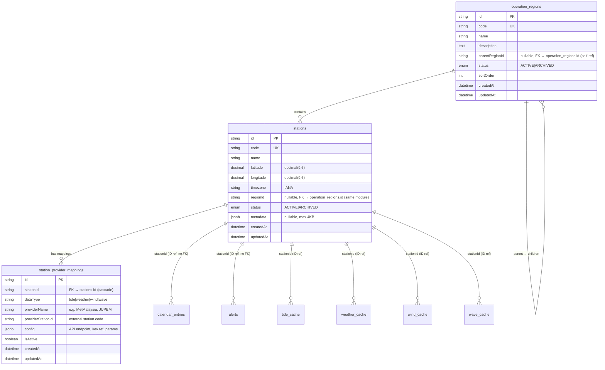

# Station Module — Entity Relationship Diagram

**Version:** 1.0.0  
**Date:** 2026-08-06  
**Status:** Proposed  
**Authorised by:** ADR-0012  
**Related:** [ERD](ERD.md) §2.6, [STATION_OWNERSHIP](../architecture/STATION_OWNERSHIP.md)

---

## 1. Mermaid ERD



> **Legend:** `FK` = enforced foreign key (within the same module). `ID ref` = logical ID reference to another module's table (**no** enforced FK cascade), per DATABASE_OWNERSHIP Rule 3.

---

## 2. Entity Specifications

### 2.1 `operation_regions`

| Column | Type | Constraints | Notes |
|--------|------|-------------|-------|
| id | text | PK | UUID |
| code | text | unique, not null | Alphanumeric + hyphen, max 32, uppercase |
| name | text | not null | Max 256 chars |
| description | text | nullable | |
| parent_region_id | text | nullable, FK → operation_regions.id (self-ref) | Supports 3-level hierarchy |
| status | enum | not null, default `ACTIVE` | `ACTIVE` \| `ARCHIVED` |
| sort_order | integer | not null, default 0 | Display ordering |
| created_at | timestamptz | not null, default now() | UTC |
| updated_at | timestamptz | not null | UTC |

> Index: `parent_region_id`, `status`.

### 2.2 `stations`

| Column | Type | Constraints | Notes |
|--------|------|-------------|-------|
| id | text | PK | UUID |
| code | text | unique, not null | Unique per org |
| name | text | not null | Max 256 chars |
| latitude | decimal(9,6) | not null | Range: -90 to 90 |
| longitude | decimal(9,6) | not null | Range: -180 to 180 |
| timezone | text | not null | IANA timezone |
| region_id | text | nullable, FK → operation_regions.id (same module) | Sub-region assignment |
| status | enum | not null, default `ACTIVE` | `ACTIVE` \| `ARCHIVED` |
| metadata | jsonb | nullable | Max 4KB |
| created_at | timestamptz | not null, default now() | UTC |
| updated_at | timestamptz | not null | UTC |

> Indexes: `code` (unique), `region_id`, `status`.

### 2.3 `station_provider_mappings`

| Column | Type | Constraints | Notes |
|--------|------|-------------|-------|
| id | text | PK | UUID |
| station_id | text | FK → stations.id (cascade), not null | |
| data_type | text | not null | Enum: `tide`, `weather`, `wind`, `wave` |
| provider_name | text | not null | e.g. `MetMalaysia`, `JUPEM` |
| provider_station_id | text | nullable | External provider's station code |
| config | jsonb | nullable | API endpoint, key reference, extra params |
| is_active | boolean | not null, default true | Enable/disable without delete |
| created_at | timestamptz | not null, default now() | UTC |
| updated_at | timestamptz | not null | UTC |

> Indexes: `(station_id, data_type)` — one active mapping per station per data type.

---

## 3. Regional Hierarchy Example

```
Operation Region: PBS — Pantai Barat Selangor
├── Sub-Region: PKG — Pelabuhan Klang
│   ├── Station: PKG-01 — Stesen Pemerhatian Pelabuhan Klang
│   └── Station: PKG-02 — Stesen Kuala Selangor
└── Sub-Region: SKG — Sekinchan
    ├── Station: SKG-01 — Stesen Sekinchan
    └── Station: SKG-02 — Stesen Sungai Besar
```

The hierarchy is **operational** — it groups stations by fisheries/enforcement area, not by state/district boundaries.

---

## 4. Provider Mapping Example

| Station | Data Type | Provider | Provider Station ID | Config |
|---------|-----------|----------|---------------------|--------|
| PKG-01 | tide | JUPEM | `PKCP001` | `{"endpoint": "...", "keyRef": "jupem.api.key"}` |
| PKG-01 | weather | MetMalaysia | `WM-PK01` | `{"endpoint": "...", "keyRef": "metmalaysia.api.key"}` |
| PKG-01 | wind | MetMalaysia | `WM-PK01` | `{"endpoint": "...", "keyRef": "metmalaysia.api.key"}` |
| PKG-01 | wave | MetMalaysia | `WM-PK01` | `{"endpoint": "...", "keyRef": "metmalaysia.api.key"}` |

A station uses JUPEM for tide and MetMalaysia for weather/wind/wave. Swapping JUPEM for a commercial tide provider requires only updating the `provider_name` and `config` in the mapping row.

---

## 5. Indexing Summary

| Table | Indexes |
|-------|---------|
| `operation_regions` | PK(id), UK(code), idx(parent_region_id), idx(status) |
| `stations` | PK(id), UK(code), idx(region_id), idx(status) |
| `station_provider_mappings` | PK(id), idx(station_id, data_type) |

---

## 6. Change Log

| Version | Date | Notes |
|---------|------|-------|
| 1.0.0 | 2026-08-06 | Initial Station ERD (ADR-0012) |
